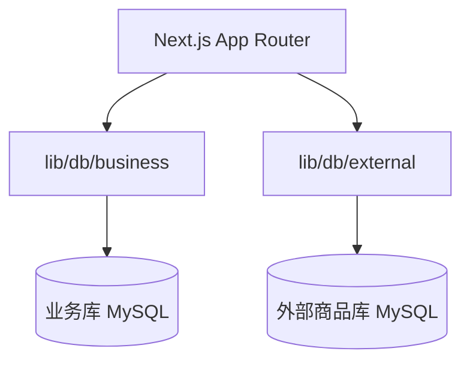

# 技术设计: Prisma 多数据库接入（业务库 + 外部商品库）

## 技术方案

### 核心技术
- Prisma ORM + MySQL
- Next.js App Router（仅在服务端使用 Prisma Client）

### 实现要点
- 在 `prisma/business/schema.prisma` 与 `prisma/external/schema.prisma` 分别维护 datasource
- 为每个 schema 设置独立 generator output，避免 Prisma Client 冲突
- 使用 `--schema` 脚本分别执行 migrate / db pull / generate
- 在 `lib/db/*` 封装 PrismaClient，并用 globalThis 缓存以避免开发态多实例
- 外部库通过 `db pull` 同步，不执行 migrate；业务库使用 migrate 管理

## 架构设计

## 架构决策 ADR

### ADR-004: 采用双 schema/双 client 的 Prisma 组织方式
**上下文:** 业务库需要迁移管理，外部库可读写但不维护表结构；MySQL 不支持多 schema 命名空间。
**决策:** 使用两个 schema 文件与独立脚本，各自生成独立 Prisma Client 输出目录。
**理由:** 降低迁移误用风险，隔离业务库与外部库的生命周期。
**替代方案:** 单 schema + preview 特性或 packages/db 抽离 → 拒绝原因: MySQL 不支持多 schema 命名空间且当前项目规模较小。
**影响:** 需要维护两套 schema 与脚本，但迁移与同步职责更清晰。

## API 设计
当前阶段不改动 API，仅提供数据访问层基础能力。

## 数据模型
- 业务库 schema 初始为空位，后续按业务模型补充并迁移
- 外部库 schema 通过 `db pull` introspection 生成

## 安全与性能
- **安全:** 连接字符串仅存放在 `.env`；外部库禁止执行 migrate；Prisma Client 仅服务端使用
- **性能:** 复用 PrismaClient，避免每次请求创建新连接

## 测试与部署
- **测试:** 生成 Client、业务库 migrate、外部库 db pull（需可访问的 DB）
- **部署:** 增加环境变量；生产环境建议使用数据库连接池或代理
