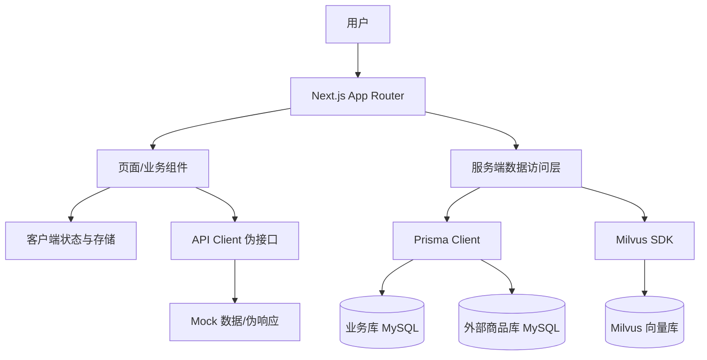
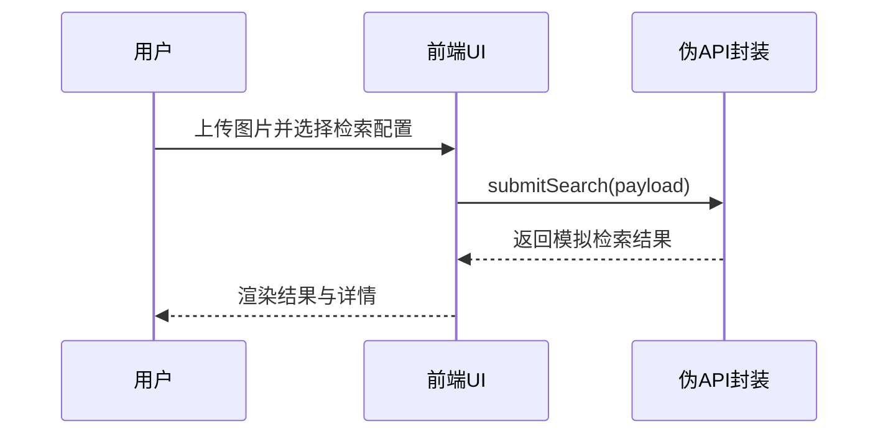

# 架构设计

## 总体架构

## 技术栈
- **后端:** 暂无真实后端（伪接口占位，已预置 Prisma 数据访问层）
- **前端:** Next.js App Router + React + TypeScript + Tailwind + shadcn/ui
- **数据:** 本地存储与内存状态 / MySQL（业务库迁移管理 + 外部库结构拉取）/ Milvus（向量库，规划）

## 核心流程

## 重大架构决策
完整的ADR存储在各变更的how.md中，本章节提供索引。

| adr_id | title | date | status | affected_modules | details |
|--------|-------|------|--------|------------------|---------|
| ADR-001 | 前端优先实现 UI/UX 与伪接口 | 2026-01-30 | ✅已采纳 | app/components/lib | 待补充 |
| ADR-002 | 采用 Route Groups 进行入口分区 | 2026-01-30 | ✅已采纳 | app | [链接](../history/2026-01/202601301535_yadang-ui-ux/how.md#adr-002-采用-route-groups-进行入口分区) |
| ADR-003 | 使用 Zustand + persist 做本地状态管理 | 2026-01-30 | ✅已采纳 | stores/lib | [链接](../history/2026-01/202601301535_yadang-ui-ux/how.md#adr-003-使用-zustand--persist-做本地状态管理) |
| ADR-004 | 采用双 schema/双 client 的 Prisma 组织方式 | 2026-01-31 | ✅已采纳 | prisma/lib | [链接](../history/2026-01/202601310841_prisma-multi-db/how.md) |
| ADR-005 | Prisma 7 仅结构拉取的多库组织 | 2026-02-04 | ✅已采纳 | prisma/lib | [链接](../history/2026-02/202602040627_prisma7-introspection/how.md) |
| ADR-006 | 业务库使用迁移，外部库仅结构拉取 | 2026-02-04 | ✅已采纳 | prisma/lib | [链接](../history/2026-02/202602040657_prisma-business-schema-dotenv/how.md) |
| ADR-007 | dotenv 统一加载环境变量 | 2026-02-04 | ✅已采纳 | lib | [链接](../history/2026-02/202602040657_prisma-business-schema-dotenv/how.md) |
| ADR-008 | Prisma 7 Config 管理多库配置 | 2026-02-04 | ✅已采纳 | prisma | [链接](../history/2026-02/202602040741_prisma7-config-mysql/how.md) |
